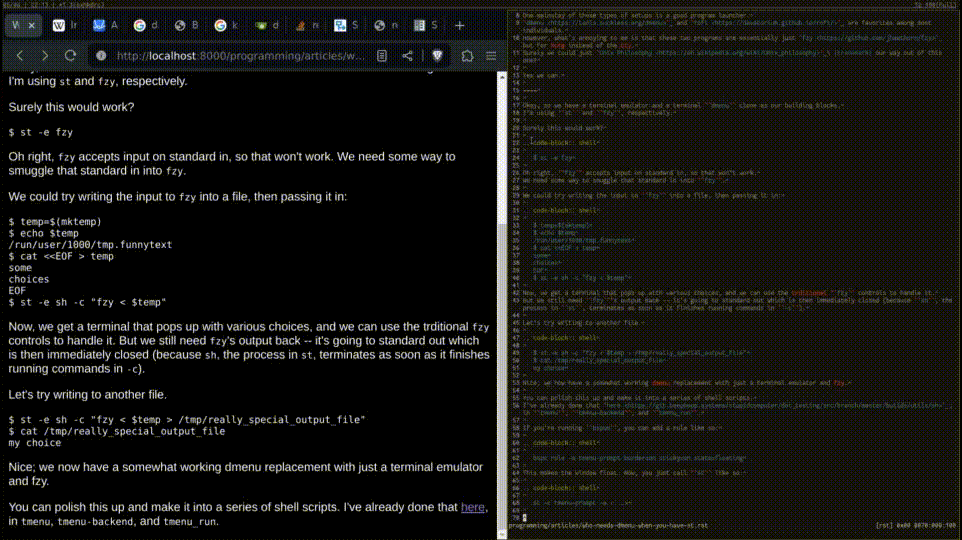

# Who needs `dmenu` when you have `st`?

I'm one of [those](https://old.reddit.com/r/unixporn) [individuals](https://wiki.installgentoo.com/wiki/GNU/Linux_ricing) who like to customize Linux desktops.
One mainstay of these types of setups is a good program launcher.
[`dmenu`](https://tools.suckless.org/dmenu) and [`rofi`](https://davatorium.github.io/rofi/) are favorites among most individuals.
However, what's annoying to me is that these two programs are essentially just [`fzy`](https://github.com/jhawthorn/fzy) but for Xorg instead of the tty.
Surely we could just [Unix Philosophy](https://en.wikipedia.org/wiki/Unix_philosophy) (tm) our way out of this one?

Yes we can.

----

Okay, so we have a terminal emulator and a terminal ``dmenu`` clone as our building blocks.
I'm using ``st`` and ``fzy``, respectively.

Surely this would work?

```
   $ st -e fzy
```

Oh right, ``fzy`` accepts input on standard in, so that won't work.
We need some way to smuggle that standard in into ``fzy``.

We could try writing the input to ``fzy`` into a file, then passing it in:

```
   $ temp=$(mktemp)
   $ echo $temp
   /run/user/1000/tmp.funnytext
   $ cat <<EOF > temp
   some
   choices
   EOF
   $ st -e sh -c "fzy < $temp"
```

Now, we get a terminal that pops up with various choices, and we can use the trditional ``fzy`` controls to handle it.
But we still need ``fzy``'s output back -- it's going to standard out which is then immediately closed (because ``sh``, the process in ``st``, terminates as soon as it finishes running commands in ``-c``).

Let's try writing to another file.

```
   $ st -e sh -c "fzy < $temp > /tmp/really_special_output_file"
   $ cat /tmp/really_special_output_file
   my choice
```

Nice; we now have a somewhat working dmenu replacement with just a terminal emulator and fzy.

You can polish this up and make it into a series of shell scripts.
I've already done that [here](https://github.com/stupidcomputer/dot_testing/tree/1621f46af1e5067453821ca5ca72e0e7327bb16d/builds/utils), in ``tmenu``, ``tmenu-backend``, and ``tmenu_run``.

If you're running ``bspwm``, you can add a rule like so:

```
   bspc rule -a tmenu-prompt border=on sticky=on state=floating
```

This makes the window float. Now, you just call ``st`` like so:

```
   st -c tmenu-prompt -e <...>
```

And we get a centered result:



----

From the ``lemonbar`` [Arch Wiki page](https://wiki.archlinux.org/title/lemonbar#Usage):

  lemonbar prints no information on its own. To get any text into lemonbar you need to pipe text into it.

Sounds an awful lot like a terminal, right?

This one's easier though -- we just have a specially arranged terminal at the top of the desktop running our program.
But how do we put it up there?

Define a ``bspwm`` rule:

```
   bspc rule -a statusbar border=off sticky=on state=floating manage=off
```

(That ``manage=off`` part makes ``bspwm`` not resize the window at all.)

Now, you need to figure out where the statusbar goes, and then start the statusbars where they need to go.
Here's some Python to do that: (``statusbar`` is the statusbar program executed in ``st``)

```
  xrandr = subprocess.Popen(['xrandr'], stdout=subprocess.PIPE, stderr=subprocess.STDOUT)
  output = list(xrandr.stdout)
  output = [i.decode("utf-8") for i in output if " connected" in i.decode("utf-8")]
  serialized = []
  for i in output:
      splitted = i.split(' ')
      print(splitted)
      displayname = splitted[0]
      geometry = splitted[2]
      if geometry == "primary":
          geometry = splitted[3]

      try:
          geometry_splitted = [int(i) for i in geometry.replace('x', '+').split('+')]
      except ValueError:
          continue
      geometry_splitted[1] = 20
      print(displayname, geometry_splitted)
      os.system("st -c statusbar -p -g {}x{}+{}+{} -e statusbar {} & disown".format(
          *map(str, geometry_splitted),
          displayname
      ))
```

The above does depend on you having a 'pixel-perfect' st patch such as [anysize](https://st.suckless.org/patches/anygeometry/).
I wrote my own, and it's enabled by using ``-p``.
