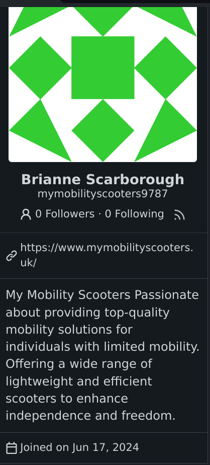

# Mobility scooters and gitea

I found something interesting on my Gitea instance today.
Apparently someone managed to create an account on my instance; this makes no sense because my instance doesn't accept registrations.

At first, I thought this was an intrusion of some sort, so I downloaded the logs from the server and copied them to my machine for analysis.
I wasn't sure how this person was able to find a vulnerability in Gitea because this was their profile page:

<a href="./mobility.png">

</a>

I don't think selling mobility scooters is in the target niche for joining a Gitea instance, but that's just my two cents.

In regards to the closed registration, I actually just disabled the sign up button, not the registration.
For those of you using NixOS, here's the diff:

```
  services.gitea = {
    enable = true;
    appName = "beepboop.systems"; # Give the site a name
    database = {
      type = "postgres";
      passwordFile = "/etc/gittea-pass"; 
    };
    settings.security.INSTALL_LOCK = true;
    settings.service = {
      SHOW_REGISTRATION_BUTTON = false;
      +DISABLE_REGISRATION = true;
    };
    settings.ui.DEFAULT_THEME = "arc-green";
    settings.api.ENABLE_SWAGGER = false;
    settings.server = {
      DOMAIN = "git.beepboop.systems";
      ROOT_URL = "https://git.beepboop.systems/";
      LANDING_PAGE = "explore";
      HTTP_PORT = 3001;
    };
  };
```

That's it.
